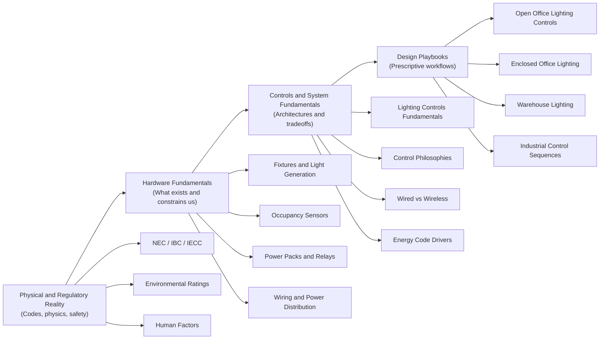
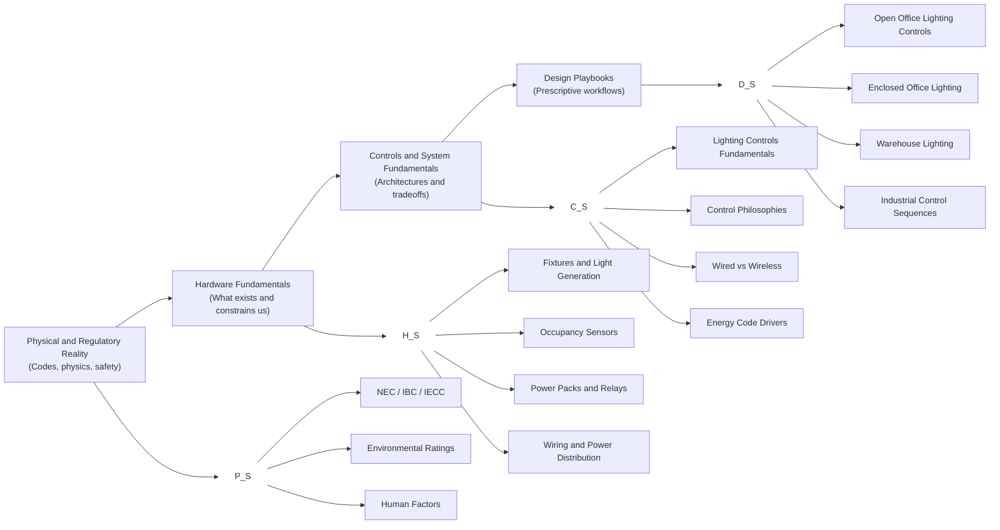

# Home — Engineering Knowledgebase

## What This Wiki Is

This wiki is an **internal engineering knowledgebase** designed to capture how we **actually design systems**, not just what components exist or what codes require.

It is built to:
- Encode **engineering judgment**, not just facts
- Provide **clear starting points** for unfamiliar problems
- Balance **speed, compliance, and robustness**
- Support both **human learning** and **AI-assisted reasoning**

This is not a marketing library, a manufacturer catalog, or a collection of isolated tips.  
It is a **working engineering reference** that reflects how design decisions are made under real-world constraints.

---

## How to Use This Wiki

Different pages serve different purposes. Knowing *where you are* matters.

- If you are learning **what exists** and **what is possible** → start with **Fundamentals**
- If you are trying to **design something now** → start with a **Design Playbook**
- If you are stuck or uncertain → follow cross-links upward or downward in abstraction

This wiki is intentionally **redundant** in places. That redundancy is a feature, not a bug.

---

# Knowledge Model Overview

## Layer 1 – Foundations (Ontology)
Ontology defines what exists in our engineered reality: physical entities, required functional constructs, and regulatory classifications. This layer contains no design guidance.
### 1. Physical Entities
Things that physically exist and are installed in the built environment.

*Note: Domains (Lighting, HVAC, Plumbing, Electrical, BAS) are branches within these ontology categories, not separate epistemological layers.*

- **Signal & Control Devices**
  - Occupancy Sensors
  - ALS Sensors
  - Thermostats
  - BAS Controllers
  - Relays
  - Time Switches
  - Power Packs

- **Energy Conversion & Conditioning**
  - LED Drivers
  - Ballasts
  - VFDs
  - Transformers
  - Power Supplies
  - UPS Systems

- **Terminal & Emitting Devices**
  - Luminaires
  - Diffusers
  - VAV Boxes
  - Pumps
  - Radiators
  - Valves

- **Electrical Power Distribution**
  - Branch Circuits
  - Feeders
  - Panels
  - Line Voltage Systems
  - Class 1 / Class 2 Circuits

- **Fluid & Thermal Distribution**
  - Piping Systems
  - Duct Systems
  - Circulators
  - Grease Interceptors
  - Mixing Valves

---

### 2. Functional Constructs
Defined system capabilities or required behaviors (not physical devices).

- Automatic Receptacle Control (ARC)
- Daylight-Responsive Control
- Vacancy Control
- Time-Switch Control
- Emergency Egress Function
- Load Shedding
- Demand Response

---

### 3. Regulatory & Classification Constructs
Code-defined abstractions and legal classifications that govern design.

- Interior Space Types
- Occupancy Classifications (IBC)
- NEC Class 2 Circuits
- Primary / Secondary Daylight Zones
- Hazardous Location Classifications
- Energy Code Control Requirements

## Layer 2 – Concepts (Behavior & Design Reasoning)
- Control Systems Concepts
- Fluid Systems Concepts
- Power Systems Concepts
- Human Factors
- Commissioning & Fragility
- etc.

## Layer 3 – Design Playbooks
- Lighting Playbooks
- HVAC Playbooks
- Plumbing Playbooks
- BAS Playbooks

Think of this as a **ladder of abstraction**:

- Lower levels define **what is allowed and possible**
- Upper levels define **what we actually do**

---

## Page Types You Will See

### 1. Fundamentals Pages

Answer questions like:
- *What is this thing?*
- *How does it behave physically?*
- *What constraints does it impose?*

Examples:
- Lighting Hardware – Fundamentals  
- Lighting Controls – Fundamentals  
- Occupancy Sensors  

These pages are **descriptive**, not prescriptive.

---

### 2. Design Playbooks

Answer questions like:
- *Where do I start?*
- *What should I do by default?*
- *When do I deviate or escalate?*

Examples:
- Open Office Lighting Controls  
- Enclosed Office Lighting Controls  
- Warehouse Lighting Controls  

These pages are **opinionated, constraint-driven, and workflow-oriented**.

They are the primary entry point for design work.

---

### 3. Reference & Deep-Dive Pages

Answer questions like:
- *Why does this work this way?*
- *What are the edge cases?*
- *How does this fail?*

Examples:
- Occupancy Sensor Field-of-View Geometry  
- Daylight Zoning Principles  
- Commissioning and Calibration  

These pages are **escape hatches**, not prerequisites.

---

## Design Philosophy

This knowledgebase reflects a few core beliefs:

- Codes define **minimums**, not good design
- Defaults are necessary — and must be defensible
- Simplicity is often more robust than optimization
- Deviations should be intentional and documented
- Engineering judgment should be **captured**, not rediscovered

---

## Status and Stewardship

This wiki is a **living system**.

- Content will evolve as codes, technology, and experience change
- Playbooks reflect **organizational judgment at a point in time**
- Each major page has an identified steward

If something feels unclear, contradictory, or out of date — that is a signal, not a failure.

---

## Where to Start

If you are:
- **New to a system or space type** → Start with a Design Playbook  
- **Researching components or constraints** → Start with Fundamentals  
- **Comparing architectures or approaches** → Follow cross-links between layers  

There is no single “correct” path — but there *is* a correct starting point for each task.

---

*This is not just a wiki — it is a knowledge operating system for engineering judgment.*
