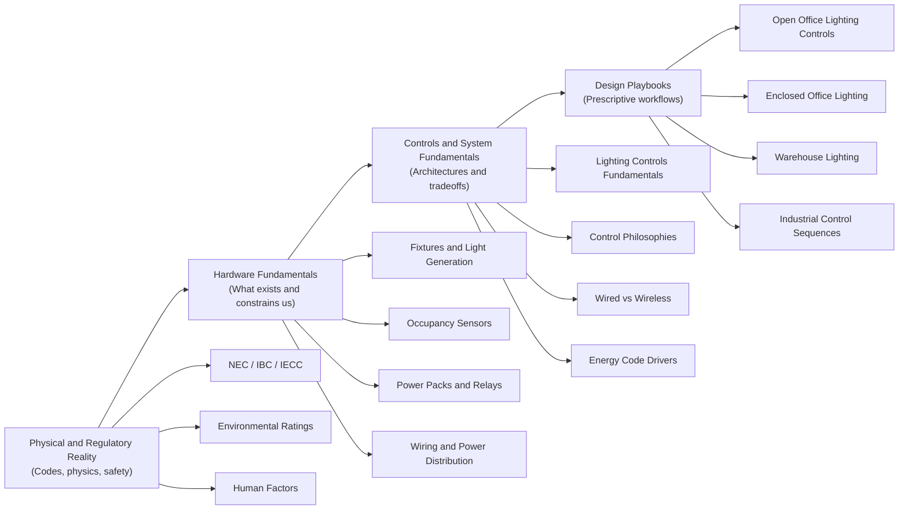
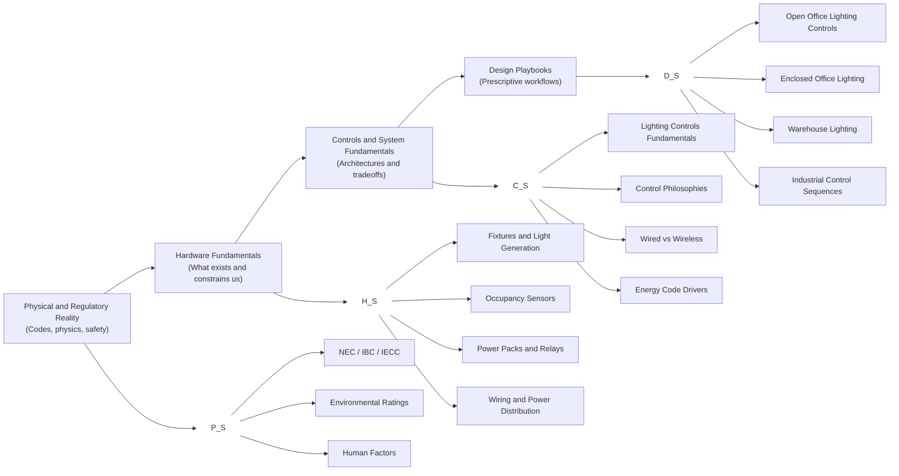

# Home — Engineering Knowledgebase

## What This Wiki Is

This wiki is an **internal engineering knowledgebase** designed to capture how we **actually design systems**, not just what components exist or what codes require.

It is built to:
- Encode **engineering judgment**, not just facts
- Provide **clear starting points** for unfamiliar problems
- Balance **speed, compliance, and robustness**
- Support both **human learning** and **AI-assisted reasoning**

This is not a marketing library, a manufacturer catalog, or a collection of isolated tips.  
It is a **working engineering reference** that reflects how design decisions are made under real-world constraints.

---

## How to Use This Wiki

Different pages serve different purposes. Knowing *where you are* matters.

- If you are learning **what exists** and **what is possible** → start with **Fundamentals**
- If you are trying to **design something now** → start with a **Design Playbook**
- If you are stuck or uncertain → follow cross-links upward or downward in abstraction

This wiki is intentionally **redundant** in places. That redundancy is a feature, not a bug.

---

# Knowledge Model Overview

## Layer 1 – Foundations (Ontology)
Ontology defines what exists in our engineered reality: physical entities, required functional constructs, and regulatory classifications. This layer contains no design guidance.
### 1. Physical Entities
Things that physically exist and are installed in the built environment.

*Note: Domains (Lighting, HVAC, Plumbing, Electrical, BAS) are branches within these ontology categories, not separate epistemological layers.*

- **Signal & Control Devices**
  - Occupancy Sensors
  - ALS Sensors
  - Thermostats
  - BAS Controllers
  - Relays
  - Time Switches
  - Power Packs

- **Energy Conversion & Conditioning**
  - LED Drivers
  - Ballasts
  - VFDs
  - Transformers
  - Power Supplies
  - UPS Systems

- **Terminal & Emitting Devices**
  - Luminaires
  - Diffusers
  - VAV Boxes
  - Pumps
  - Radiators
  - Valves

- **Electrical Power Distribution**
  - Branch Circuits
  - Feeders
  - Panels
  - Line Voltage Systems
  - Class 1 / Class 2 Circuits

- **Fluid & Thermal Distribution**
  - Piping Systems
  - Duct Systems
  - Circulators
  - Grease Interceptors
  - Mixing Valves

---

### 2. Functional Constructs
Defined system capabilities or required behaviors (not physical devices).

- Automatic Receptacle Control (ARC)
- Daylight-Responsive Control
- Vacancy Control
- Time-Switch Control
- Emergency Egress Function
- Load Shedding
- Demand Response

---

### 3. Regulatory & Classification Constructs
Code-defined abstractions and legal classifications that govern design.

- Interior Space Types
- Occupancy Classifications (IBC)
- NEC Class 2 Circuits
- Primary / Secondary Daylight Zones
- Hazardous Location Classifications
- Energy Code Control Requirements

## Layer 2 – Concepts (Behavior & Design Reasoning)
- Control Systems Concepts
- Fluid Systems Concepts
- Power Systems Concepts
- Human Factors
- Commissioning & Fragility
- etc.

## Layer 3 – Design Playbooks
- Lighting Playbooks
- HVAC Playbooks
- Plumbing Playbooks
- BAS Playbooks

Think of this as a **ladder of abstraction**:

- Lower levels define **what is allowed and possible**
- Upper levels define **what we actually do**

---

## Page Types You Will See

This knowledgebase contains multiple page types. Each serves a different purpose.

Understanding the type of page you are on is important.

---

### 1. Foundations (Ontology)

Define what exists in our engineered reality.

These pages answer:
- What is this thing?
- How is it defined?
- What intrinsic properties and limits does it have?
- What regulatory construct governs it?

Examples:
- Occupancy Sensors  
- Automatic Receptacle Control  
- NEC Class 2 Circuits  
- Interior Space Types  

These pages are declarative and contain no design guidance.

---

### 2. Concepts (System Behavior & Design Patterns)

Explain how systems behave and interact.

These pages answer:
- What forces shape solutions?
- What tradeoffs emerge?
- What tends to fail?
- What patterns repeat across systems?

Examples:
- Control Zoning Principles  
- Sensor Coverage Geometry  
- Commissioning Fragility  
- Pump Head Tradeoffs  

These pages are analytical, not prescriptive.

---

### 3. Constraint Synthesis Pages

Aggregate the constraints acting on a specific context before design decisions are made.

These pages answer:
- What code constraints apply?
- What environmental conditions matter?
- What usage assumptions exist?
- What forces must be considered before choosing a solution?

Examples:
- Enclosed Office — Constraint Envelope  
- Commercial Kitchen — Regulatory Constraints  
- High-Pile Storage — Detection Constraints  

These pages do not prescribe solutions. They define the envelope of reality.

---

### 4. Design Playbooks

Encode firm standards and decision paths.

These pages answer:
- What do we do by default?
- When do we branch?
- What triggers escalation?
- What documentation is required?

Examples:
- Enclosed Office Lighting Controls  
- Warehouse Lighting Controls  
- VAV Reheat Control Strategy  

These pages are prescriptive and workflow-oriented.

---

### 5. Reference & Deep-Dive Pages

Provide expanded technical detail without overloading core pages.

These pages answer:
- Why does this behave this way?
- What are edge cases?
- How does this fail?
- What are advanced considerations?

These pages are optional but valuable.

---

### 6. Governance & Doctrine

Define how this knowledge system works.

Examples:
- Knowledge Model Structure  
- Playbook Authoring Standards  
- Documentation Philosophy  

These pages govern the structure and evolution of the knowledgebase itself.
