## How to Use This Map (Very Important)

This map is not documentation for its own sake. It is a **thinking aid** and a **systems reference** for how the KIS Knowledge Model is structured and why it works the way it does.

When returning to this map later, use it as follows:

### 1. Decoding “Big Words”
If a term feels abstract, academic, or overloaded (for example *Epistemic Hygiene*, *Decision Axes*, or *Constraint-Synthesis*):

- Follow the arrow from the term to its associated definition node
- Treat that definition as the **operational meaning** of the term within KIS
- Ignore external or philosophical definitions unless explicitly referenced elsewhere

In KIS, vocabulary is intentionally constrained.  
Each term means **one thing**, and that meaning is tied to how design decisions are made.

---

### 2. Understanding Redundancy
Some ideas appear in multiple places in the map. This is intentional.

Redundancy exists to protect against different failure modes:
- Misclassification
- Scope creep
- Late-phase redesign
- Cross-discipline misalignment

If two concepts seem similar, look at **what outputs they connect to**:
- Different outputs mean different risks are being managed
- Similar language does not imply duplicate purpose

---

### 3. Navigating Page Types
When deciding where new information belongs, use this mental test:

- **Fundamentals Pages**  
  Define reality: physics, definitions, thresholds, stable concepts

- **Code Interpretation Pages**  
  Explain how rules apply, where triggers occur, and how jurisdictions branch

- **Constraint-Synthesis Pages**  
  Force decisions by binding assumptions, risks, RFIs, and consequences

- **Playbooks**  
  Capture repeatable solution patterns and branching logic

- **Design Pages**  
  Produce project-specific narratives, calculations, and implementation details

If information does not clearly fit one category, it likely belongs in a **Constraint-Synthesis Page** until proven otherwise.

---

### 4. Reading the Map Structure
This map is intentionally **not purely hierarchical**.

- Radial structures show **conceptual ownership**
- Crosslinks show **real-world coupling**
- Dense areas indicate **high-risk decision zones**

Do not attempt to “flatten” the map.  
Complexity here reflects real engineering complexity.

---

## Why This Map Also Helps AI Agents

This map is designed to be readable by humans **and** consumable by AI agents.

### 1. Vocabulary Normalization
By pairing concepts with short, explicit definitions:
- Ambiguity is reduced
- Synonyms are constrained
- Reasoning becomes more consistent

AI agents rely on **stable semantic anchors**, not prose elegance.

---

### 2. Explicit Reasoning Pathways
The map makes reasoning pathways visible:

- Triggers lead to retrieval
- Decision axes guide analysis
- Assumptions become variables
- Consequence logic produces outcomes
- RFIs emerge from uncertainty

This allows an AI agent to **reason**, not just search.

---

### 3. Separation of Knowledge Roles
Each page type has a clear role:
- What is true
- What is assumed
- What must be decided
- What can be reused
- What is project-specific

This prevents AI agents from:
- Treating examples as rules
- Treating rules as assumptions
- Treating assumptions as facts

---

### 4. Long-Term Stability
This structure is intentionally durable:
- Technologies may change
- Codes may evolve
- Tools may be replaced

But the **decision logic and failure modes** captured here remain relevant.

The goal is not automation for its own sake.  
The goal is **preserving engineering judgment in a form that can be reused, audited, and reasoned about**.

```mermaid
graph TD

%% =========================
%% KIS KNOWLEDGE MODEL
%% Conceptual Mind Map
%% =========================

KIS["KIS Knowledge Model<br/>AI-centric wiki.js Markdown system<br/><i>assumptions & constraints as first-class objects</i>"]

KIS --> Intent["Design Intent & Epistemic Hygiene<br/><i>make implicit assumptions explicit</i>"]
KIS --> Pages["Page Taxonomy<br/><i>typed knowledge artifacts</i>"]
KIS --> Meta["Metadata Layer<br/><i>decision-oriented indexing</i>"]
KIS --> AI["AI Agent Consumption Model<br/><i>retrieval + reasoning + action</i>"]
KIS --> Outputs["Engineering Outputs<br/><i>narratives, RFIs, play selections</i>"]

%% -------------------------
%% Intent / Philosophy
%% -------------------------
Intent --> Risk["Risk Containment<br/>misclassification, scope creep, late-phase redesign"]
Intent --> Trace["Traceability<br/><i>cause → effect mapping</i>"]
Intent --> XDisc["Cross-Discipline Coordination<br/><i>MEP ↔ Lighting ↔ Fire ↔ Ops</i>"]
Intent --> Reality["Physical Geometry vs Operational Reality<br/><i>appearance ≠ use</i>"]

%% -------------------------
%% Page Taxonomy
%% -------------------------
Pages --> Fundamentals["Fundamentals Pages<br/><i>stable concepts / definitions / physics</i>"]
Pages --> Constraint["Constraint-Synthesis Pages<br/><i>decision nexus; assumptions + RFIs + failure modes</i>"]
Pages --> Playbooks["Playbooks<br/><i>repeatable solution patterns + branches</i>"]
Pages --> Designs["Design Pages<br/><i>narratives + calculations + implementation notes</i>"]
Pages --> Products["Product Type / Class Pages<br/><i>capabilities, constraints, ecosystems</i>"]
Pages --> CodeInterp["Code Interpretation Pages<br/><i>code triggers, definitions, scoping</i>"]
Pages --> Templates["Templates<br/><i>structure & consistency for authoring</i>"]

%% -------------------------
%% Specific artifacts we touched
%% -------------------------
Constraint --> WH["Warehouse Design — Storage Height, Material Handling, Ventilation Constraints<br/><i>operationally-dependent classification logic</i>"]
Templates --> CS_Tmpl["Constraint & Assumption Synthesis Template<br/><i>‘more is more’ metadata + sections</i>"]
Playbooks --> OfficeLC["Enclosed Office Lighting Controls Playbook<br/><i>IECC vs ASHRAE vs CA branches</i>"]
Designs --> DesignNarr["Design Narratives<br/><i>defensible, review-ready descriptions</i>"]
CodeInterp --> IECC["IECC Interpretation Nodes<br/><i>DCV, ARC coupling, lighting controls</i>"]

%% -------------------------
%% Metadata Layer
%% -------------------------
Meta --> Front["Frontmatter / Page Metadata<br/><i>YAML or equivalent</i>"]
Meta --> Class["Classification Metadata<br/><i>page_type, domain, discipline_scope</i>"]
Meta --> Triggers["Invocation Triggers<br/><i>geometry / systems / program signals / uncertainty flags</i>"]
Meta --> Axes["Decision Axes<br/><i>what this page helps decide</i>"]
Meta --> AssumpObj["Assumption Objects<br/><i>id, statement, derived_from, invalidated_if</i>"]
Meta --> Logic["Consequence Logic<br/><i>if → then mappings</i>"]
Meta --> RFILogic["RFI Automation Logic<br/><i>missing/conflicting → question</i>"]
Meta --> Graph["Knowledge Graph Links<br/><i>upstream / lateral / downstream</i>"]

%% -------------------------
%% AI Agent Model
%% -------------------------
AI --> Retrieve["Retrieval Strategy<br/><i>trigger-based + graph-based recall</i>"]
AI --> Reason["Reasoning Scaffold<br/><i>decision axes + consequence logic</i>"]
AI --> Validate["Assumption Validation<br/><i>detect invalidation conditions</i>"]
AI --> Ask["Question Generation<br/><i>RFIs as structured outputs</i>"]
AI --> Compose["Narrative Composition<br/><i>Basis-of-Design-ready language</i>"]
AI --> Select["Playbook Selection<br/><i>branching per code & operations</i>"]

%% -------------------------
%% Engineering Outputs
%% -------------------------
Outputs --> BOD["Basis of Design Statements<br/><i>clear, declarative, testable</i>"]
Outputs --> RFIs["Critical RFIs List<br/><i>owner/ops/AHJ confirmation points</i>"]
Outputs --> Coord["Coordination Notes<br/><i>discipline dependencies</i>"]
Outputs --> Control["Controls Strategy<br/><i>DCV eligibility, sensing exclusions</i>"]
Outputs --> RiskLog["Failure Modes & Late-Phase Traps<br/><i>scope creep detection</i>"]

%% -------------------------
%% Major crosslinks (minimal, high value)
%% -------------------------

%% Fundamentals & Code feed Constraints and Playbooks
Fundamentals --> Constraint
CodeInterp --> Constraint
Fundamentals --> Playbooks
CodeInterp --> Playbooks

%% Product capabilities constrain Playbooks and Designs
Products --> Playbooks
Products --> Designs

%% Constraints drive RFIs, Narratives, and Playbook selection
Constraint --> RFIs
Constraint --> DesignNarr
Constraint --> Select

%% Metadata enables retrieval + reasoning
Triggers --> Retrieve
Axes --> Reason
AssumpObj --> Validate
Logic --> Reason
RFILogic --> Ask
Graph --> Retrieve

%% Warehouse page exemplifies operational reality reasoning
WH --> Reality
WH --> RFIs
WH --> Control
WH --> RiskLog
```

```mermaid
graph TD

%% =========================
%% ROOT
%% =========================

KIS[KIS Knowledge Model]

%% =========================
%% CORE PHILOSOPHY
%% =========================

EPH[Epistemic hygiene]
EPH_DEF[Practice of making assumptions explicit and testable]

TRACE[Traceability]
TRACE_DEF[Ability to explain why a decision was made]

GEOOP[Geometry not equal operation]
GEOOP_DEF[Physical form does not determine real use]

RISK[Risk containment]
RISK_DEF[Prevent avoidable redesign and rework]

XDISC[Cross discipline coupling]
XDISC_DEF[Design decisions span multiple disciplines]

SCOPE[Prevent scope creep]
SCOPE_DEF[Stop late unplanned expansion of requirements]

KIS --> EPH
KIS --> TRACE
KIS --> GEOOP
KIS --> RISK
KIS --> XDISC
KIS --> SCOPE

EPH --> EPH_DEF
TRACE --> TRACE_DEF
GEOOP --> GEOOP_DEF
RISK --> RISK_DEF
XDISC --> XDISC_DEF
SCOPE --> SCOPE_DEF

%% =========================
%% PAGE TAXONOMY
%% =========================

TAX[Typed knowledge pages]

FUND[Fundamentals pages]
FUND_DEF[Stable definitions physics and thresholds]

CODE[Code interpretation pages]
CODE_DEF[How codes apply and where they trigger]

CONS[Constraint synthesis pages]
CONS_DEF[Decision focused pages that bind assumptions to outcomes]

PLAY[Playbooks]
PLAY_DEF[Repeatable solution patterns with branches]

DES[Design pages]
DES_DEF[Project specific narratives and calculations]

PROD[Product type class pages]
PROD_DEF[What products imply and constrain]

TMPL[Templates]
TMPL_DEF[Standard structure for consistency]

KIS --> TAX
TAX --> FUND
TAX --> CODE
TAX --> CONS
TAX --> PLAY
TAX --> DES
TAX --> PROD
TAX --> TMPL

FUND --> FUND_DEF
CODE --> CODE_DEF
CONS --> CONS_DEF
PLAY --> PLAY_DEF
DES --> DES_DEF
PROD --> PROD_DEF
TMPL --> TMPL_DEF

%% =========================
%% METADATA LAYER
%% =========================

META[Metadata layer]
META_DEF[Machine readable description of meaning and relevance]

CLASS[Classification metadata]
CLASS_DEF[What kind of page this is]

TRIG[Invocation triggers]
TRIG_DEF[When an AI should look at this page]

AXES[Decision axes]
AXES_DEF[What questions this page helps answer]

ASSUME[Assumption objects]
ASSUME_DEF[Explicit statements that must stay true]

CONSLOG[Consequence logic]
CONSLOG_DEF[If then mapping from assumption to decision]

RFI[RFI logic]
RFI_DEF[Turn missing info into questions]

GRAPH[Knowledge graph links]
GRAPH_DEF[How pages relate to each other]

KIS --> META
META --> META_DEF
META --> CLASS
META --> TRIG
META --> AXES
META --> ASSUME
META --> CONSLOG
META --> RFI
META --> GRAPH

CLASS --> CLASS_DEF
TRIG --> TRIG_DEF
AXES --> AXES_DEF
ASSUME --> ASSUME_DEF
CONSLOG --> CONSLOG_DEF
RFI --> RFI_DEF
GRAPH --> GRAPH_DEF

%% =========================
%% AI AGENT MODEL
%% =========================

AI[AI agent]
AI_DEF[System that reads models and produces design reasoning]

RET[Retrieval]
RET_DEF[Find relevant knowledge]

REASON[Reasoning scaffold]
REASON_DEF[Apply logic to reach decisions]

VALID[Validation]
VALID_DEF[Check if assumptions still hold]

ASK[Question generation]
ASK_DEF[Create RFIs when uncertain]

SELECT[Playbook selection]
SELECT_DEF[Choose solution pattern]

WRITE[Narrative composition]
WRITE_DEF[Explain decisions clearly]

AI --> AI_DEF
AI --> RET
AI --> REASON
AI --> VALID
AI --> ASK
AI --> SELECT
AI --> WRITE

RET --> RET_DEF
REASON --> REASON_DEF
VALID --> VALID_DEF
ASK --> ASK_DEF
SELECT --> SELECT_DEF
WRITE --> WRITE_DEF

META --> RET
META --> REASON
META --> VALID
META --> ASK

%% =========================
%% OUTPUTS
%% =========================

OUT[Engineering outputs]

BOD[Basis of design]
BOD_DEF[Declarative statements of intent]

RFILIST[RFI list]
RFILIST_DEF[Questions that lock assumptions]

CTRL[Controls narrative]
CTRL_DEF[Why controls were chosen]

RISKLOG[Risk register]
RISKLOG_DEF[Known failure modes]

OUT --> BOD
OUT --> RFILIST
OUT --> CTRL
OUT --> RISKLOG

BOD --> BOD_DEF
RFILIST --> RFILIST_DEF
CTRL --> CTRL_DEF
RISKLOG --> RISKLOG_DEF

AI --> OUT

%% =========================
%% EXEMPLAR WAREHOUSE NODE
%% =========================

WH[Warehouse constraint page]
WH_DEF[Operational reality overrides appearance]

STORE[Storage height not equal rack height]
STORE_DEF[Usable storage lower than structure]

LIGHT[Lighting plane caps storage]
LIGHT_DEF[Lights define practical limits]

FORK[Material handling type]
FORK_DEF[Equipment choice drives IAQ needs]

DCV[DCV eligibility]
DCV_DEF[Ventilation based on people not machines]

WH --> WH_DEF
WH --> STORE
WH --> LIGHT
WH --> FORK
WH --> DCV

STORE --> STORE_DEF
LIGHT --> LIGHT_DEF
FORK --> FORK_DEF
DCV --> DCV_DEF

LIGHT --> STORE
FORK --> DCV
FORK --> CONSLOG
WH --> CONS
WH --> RFILIST
WH --> BOD


```

