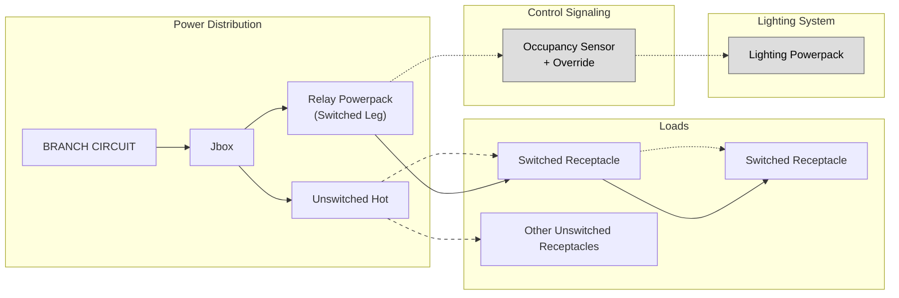
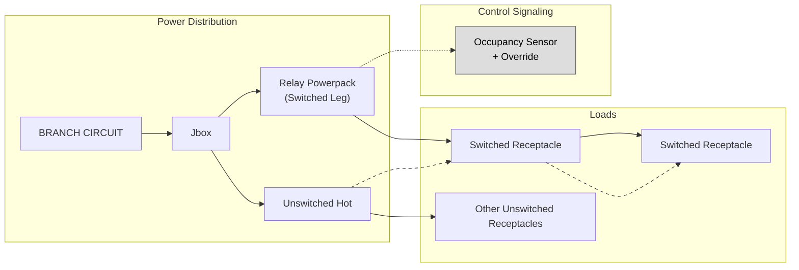
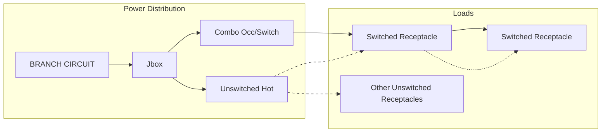
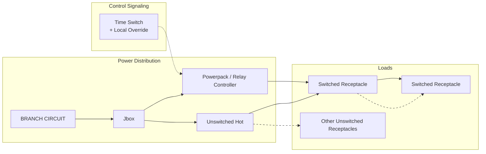

# Automatic Receptacle Control (ARC)

---

# 0. Purpose and Scope

## What this function is

Automatic Receptacle Control (ARC) is a system function that automatically removes power from designated receptacles when the associated space is unoccupied or during defined periods of inactivity.

The purpose of ARC is to reduce **plug-load energy consumption** by ensuring that equipment connected to receptacles does not remain energized unnecessarily.

ARC is typically required by modern energy codes such as **IECC and ASHRAE 90.1**.

---

## Why this function exists

Plug loads represent a growing portion of building energy consumption. Many devices remain energized even when a space is not in use.

Energy codes introduced Automatic Receptacle Control to:

- Reduce standby energy consumption
- Encourage occupant awareness of plug loads
- Improve building energy performance

---

## What this page covers

This page describes:

- The required **system behavior** of ARC
- Regulatory frameworks that trigger ARC
- Common **implementation architectures**
- Integration with other building systems
- Operational and commissioning considerations

---

## What this page does NOT do

This page does not:

- Define project-specific wiring diagrams
- Establish company-specific design standards
- Replace code references or local amendments

Design standards are defined in **ARC design playbooks**.

---

# 1. Core Function

## 1.1 Required Behavior

ARC systems must automatically remove power from designated receptacles when conditions indicate that the space is not actively in use.

Typical behaviors include:

- Automatic shutoff of controlled receptacles
- Occupant override capability
- Restoration of power upon occupancy detection or manual action

---

## 1.2 System Outputs Produced

ARC typically controls:

- Switched receptacle circuits
- Split receptacles (half-controlled)
- Controlled plug-load panels
- Relay-controlled branch circuits

---

## 1.3 System Inputs Required

ARC may use one or more of the following inputs:

- Occupancy detection
- Time schedules
- BAS control signals
- Manual override switches
- Lighting control system state

---

## 1.4 Expected Operational Behavior

Typical ARC operation includes:

- Automatic shutoff after vacancy detection
- Automatic restoration upon occupancy
- Manual override capability for occupants
- Reset of override after a defined period

---

# 2. Regulatory Requirements (Constraints)

## 2.1 Governing Codes

ARC requirements are primarily driven by energy codes such as:

- IECC (2015 and later)
- ASHRAE 90.1
- Local energy code amendments

---

## 2.2 Typical Regulatory Requirements

Energy codes typically require:

- A defined percentage of receptacles to be controlled
- Automatic shutoff when a space is unoccupied
- Occupant override capability
- Maximum override duration limits
- Similar to lighting occupancy sensor requirements

---

## 2.3 Typical Spaces Where ARC Applies

ARC is commonly required in:

- Enclosed offices
- Open office workstations
- Conference rooms
- Printer rooms
- Break rooms
- Classrooms

Specific requirements depend on the code version and jurisdiction.

---

# 3. Functional Components and Variants

ARC can be implemented using several system architectures.

These approaches differ in cost, reliability, wiring complexity, and integration with other systems.

---

## 3.1 Lighting Controls Integrated Method (Typical KIS Implementation)

This method integrates ARC with the **lighting occupancy sensing system**.

### Overview

The same occupancy sensor that controls lighting also triggers ARC through a relay device.

This approach minimizes additional hardware and ensures consistent behavior between lighting and receptacles.

---

### Typical System Components

- Occupancy sensor (wall-mounted or ceiling-mounted)
- Lighting control power pack
- Secondary relay power pack controlling receptacle circuit
- Controlled receptacle wiring

---

### Typical Wiring Architecture

1. Occupancy sensor detects occupancy
2. Sensor signal feeds lighting power pack
3. A second relay power pack is wired to the same sensor signal
4. Relay switches the controlled receptacle circuit

---

### Advantages

- Minimal additional sensors
- Consistent behavior between lighting and receptacles
- Lower installation cost
- Simplified commissioning

---

### Limitations

- Requires compatible control ecosystem
- Requires coordination between electrical and lighting control systems
- Requires clear documentation for contractors

---

## 3.2 Standalone Occupancy Sensor + Power Pack

ARC is implemented using a **dedicated occupancy sensor controlling receptacle circuits**.

Typical components:

- Ceiling or wall occupancy sensor
- Relay power pack controlling receptacle circuit

This method separates ARC from lighting control systems.

---

## 3.3 Line Voltage Occupancy Sensor Switching Receptacle Circuit

Some occupancy sensors are rated to switch full branch circuits.

Example implementation:

- Wall-mounted line-voltage occupancy sensor
- Sensor directly switches receptacle circuit

Advantages:

- Simplified wiring
- No relay module required

Limitations:

- Limited sensor load ratings
- May not support advanced control integration

---

## 3.4 Time-Switch Controlled Receptacles

ARC can also be implemented using **time scheduling**.

Typical components:

- Digital time switch
- Panel relay
- BAS scheduling

Typical behavior:

- Receptacles disabled outside of business hours
- Occupant override permitted

---

## 3.5 Smart Receptacles / Networked Plug Load Control

Emerging approach using:

- Networked receptacles
- Wireless plug load controllers
- Integrated BAS control

This approach allows:

- Granular device-level control
- Energy monitoring
- Remote management

---

## 3.6 Panel-Based Relay Systems

In larger buildings ARC may be implemented using centralized relay panels.

Typical components:

- Lighting control panel
- Branch circuit relays
- BAS integration

---

# 4. System Interfaces and External Requirements

## 4.1 Electrical Interfaces

ARC systems must interface with:

- Branch circuit wiring
- Split receptacle configurations
- Controlled receptacle identification

---

## 4.2 Control Interfaces

ARC systems often integrate with:

- Occupancy sensors
- Lighting control systems
- BAS systems
- Time scheduling systems

---

## 4.3 User Interfaces

Typical occupant interfaces include:

- Manual override switches
- Lighting control switches
- BAS interfaces
- Local pushbutton reset devices

---

# 5. Typical Application Contexts

## 5.1 Office Environments

- Enclosed offices
- Open offices
- Conference rooms

---

## 5.2 Educational Spaces

- Classrooms
- Faculty offices
- Study spaces

---

## 5.3 Commercial Buildings

- Break rooms
- Training rooms
- Administrative spaces

---

# 6. Historical Context and Evolution

ARC requirements began appearing in energy codes in response to increasing plug-load energy consumption.

Earlier buildings rarely controlled receptacles automatically. Modern energy codes now treat plug loads as a major energy conservation opportunity.

---

# 7. Pitfalls, Assumptions, and Failure Modes

## 7.1 Common Pitfalls

- Incorrectly wiring controlled receptacles
- Mixing controlled and uncontrolled circuits
- Failure to label controlled outlets

---

## 7.2 Common Assumptions

ARC assumes that connected loads can tolerate automatic shutoff.

Devices such as:

- refrigerators
- medical equipment
- servers

must not be connected to controlled receptacles.

---

## 7.3 Failure Modes

Typical issues include:

- relay failure
- sensor misconfiguration
- occupant confusion regarding controlled outlets

---

# 8. System Cost and Implementation Reality

Cost varies depending on the chosen architecture.

Lighting-integrated ARC is often the most economical approach in small rooms.

Panel-based or smart receptacle systems are typically used in larger or more complex buildings.

---

# 9. Procurement and Ecosystem Constraints

ARC implementations often depend on vendor ecosystems including:

- Lighting control manufacturers
- BAS vendors
- Electrical relay panel suppliers

Compatibility between systems is often required.

---

# 10. Implementation Strategy Considerations

Factors influencing ARC implementation include:

- Space size
- Existing lighting control architecture
- Branch circuit layout
- Owner preferences
- BAS integration requirements

---

# 11. Commissioning and Validation

Commissioning typically verifies:

- correct receptacle wiring
- proper occupancy detection
- proper shutoff timing
- override functionality

---

# 12. Monitoring, Reliability, and Lifecycle Considerations

ARC systems may require:

- periodic functional verification
- sensor calibration
- relay replacement over time

Advanced systems may include monitoring through BAS platforms.

---

# 13. Cross-links and Navigation

Related topics:

- [[Occupancy Sensors]]
- [[IECC Automatic Receptacle Control Requirements]]
- [[Lighting Control Systems]]
- [[Enclosed Office Lighting Controls Playbook]]

---

# 14. Status and Stewardship

Status: Draft  
Steward: Electrical Engineering Discipline
